# Gemini API 免费代理项目原理解析报告

## 目录

1. [核心原理与总体架构](#一核心原理与总体架构)
2. [后端分析 (aistudio-build-proxy)](#二后端分析-aistudio-build-proxy)
3. [前端分析 (proxy-gemini-chat-ui-autorun)](#三前端分析-proxy-gemini-chat-ui-autorun)
4. [数据流图与时序图](#四数据流图与时序图)
5. [技术要点总结](#五技术要点总结)

---

## 一、核心原理与总体架构

该项目的核心在于巧妙地利用了 **Google AI Studio Build 页面的 `fetch` 函数劫持（Hook）机制**。

### 1.1 核心原理

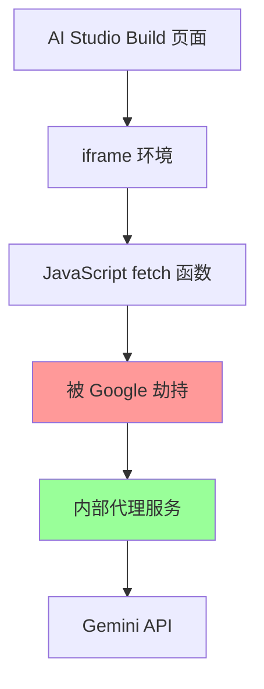

当在 Google AI Studio 的 Build 页面中运行网页应用时：

1. **环境特殊性**: 页面运行在特殊的 `iframe` 环境中
2. **函数劫持**: 浏览器的 `fetch` 函数被 Google 的脚本自动劫持
3. **请求代理**: 对 `generativelanguage.googleapis.com` 的请求被内部代理处理
4. **免费调用**: **无需 API Key** 即可访问 Gemini API

### 1.2 总体架构

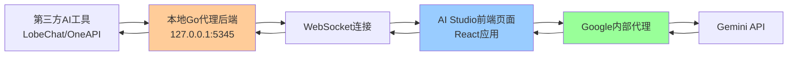

### 1.3 数据流路径

```
[第三方AI工具] 
    ↓ HTTP请求
[本地Go代理后端] 
    ↓ WebSocket消息
[AI Studio前端页面] 
    ↓ 被劫持的fetch
[Google内部代理] 
    ↓ 内部调用
[Gemini API]
```

---

## 二、后端分析 (aistudio-build-proxy)

后端是用 Go 语言编写的 HTTP 和 WebSocket 服务器，承担"翻译官"和"调度员"的角色。

### 2.1 服务架构

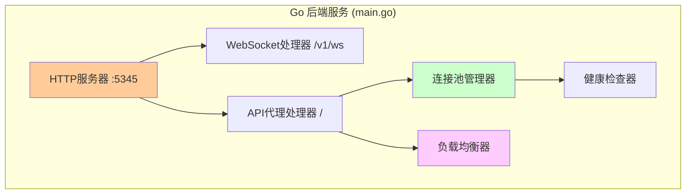

### 2.2 关键组件

#### 2.2.1 启动与路由

```go
// main.go:801
server := &http.Server{
    Addr:    ":5345",  // 监听本地5345端口
    Handler: mux,
}
```

**关键路由设置:**
- `/v1/ws` - WebSocket连接处理 ([main.go:790](aistudio-build-proxy/main.go#L790))
- `/` - API请求代理处理 ([main.go:798](aistudio-build-proxy/main.go#L798))

#### 2.2.2 连接池管理

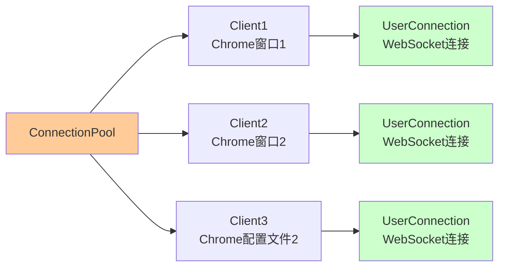

**连接池特性:**
- 支持多个前端同时连接
- 基于 `clientID` 的连接管理
- 自动替换断开的连接

#### 2.2.3 负载均衡机制

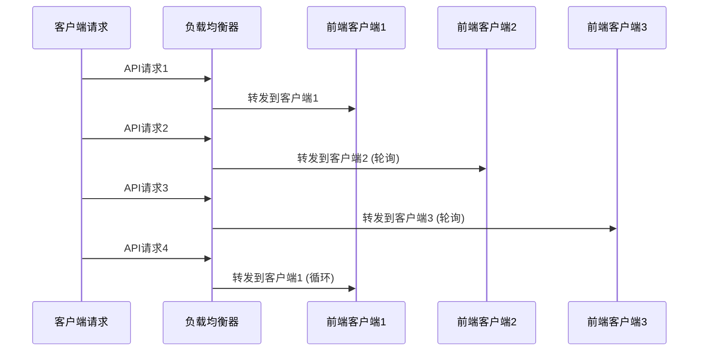

**轮询算法实现:**
```go
// main.go:101
var nextClientIndex uint32

// main.go:437 - 轮询选择客户端
startIdx := atomic.AddUint32(&nextClientIndex, 1) - 1
clientID := clientList[(startIdx+uint32(i))%uint32(len(clientList))]
```

### 2.3 请求处理流程

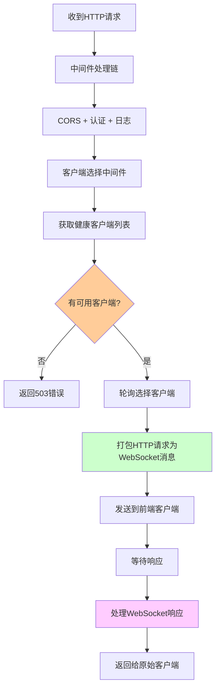

### 2.4 健康检查机制

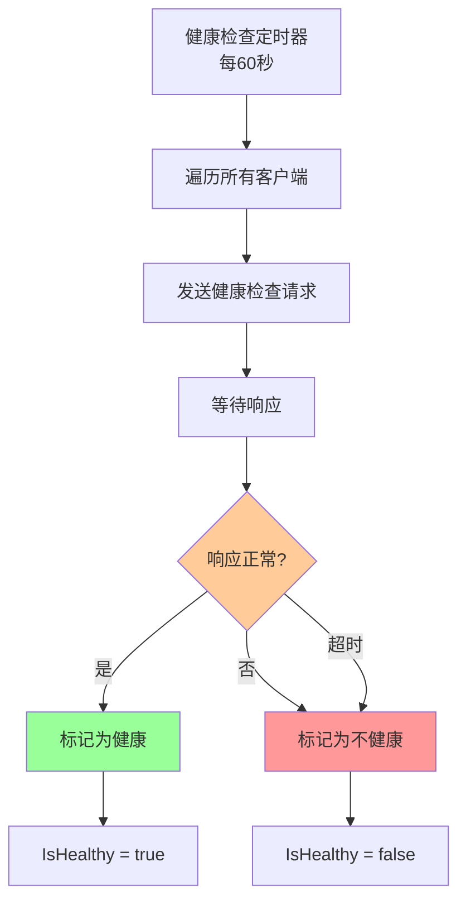

---

## 三、前端分析 (proxy-gemini-chat-ui-autorun)

前端是运行在 AI Studio 环境中的 React 应用，作为"执行代理"。

### 3.1 应用架构

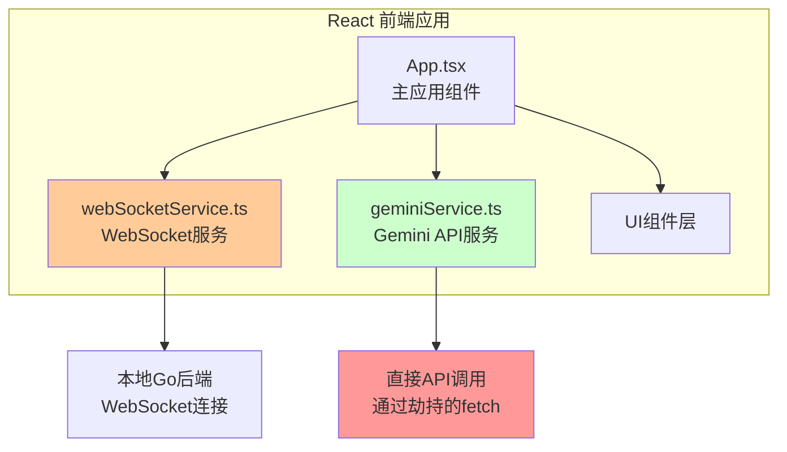

### 3.2 WebSocket 连接流程

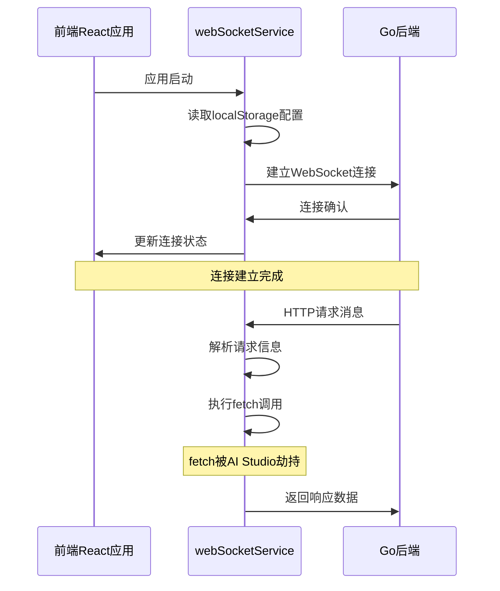

### 3.3 关键执行逻辑

#### 3.3.1 fetch 劫持的核心机制

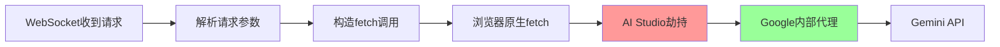

#### 3.3.2 响应处理分类

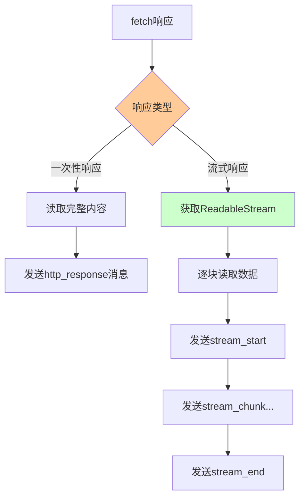

### 3.4 消息类型定义

```typescript
// types.ts 中定义的关键消息类型
interface WSMessage {
  id: string;
  type: 'http_request' | 'http_response' | 'stream_start' | 'stream_chunk' | 'stream_end' | 'error';
  payload: any;
}
```

---

## 四、数据流图与时序图

### 4.1 完整请求流程时序图

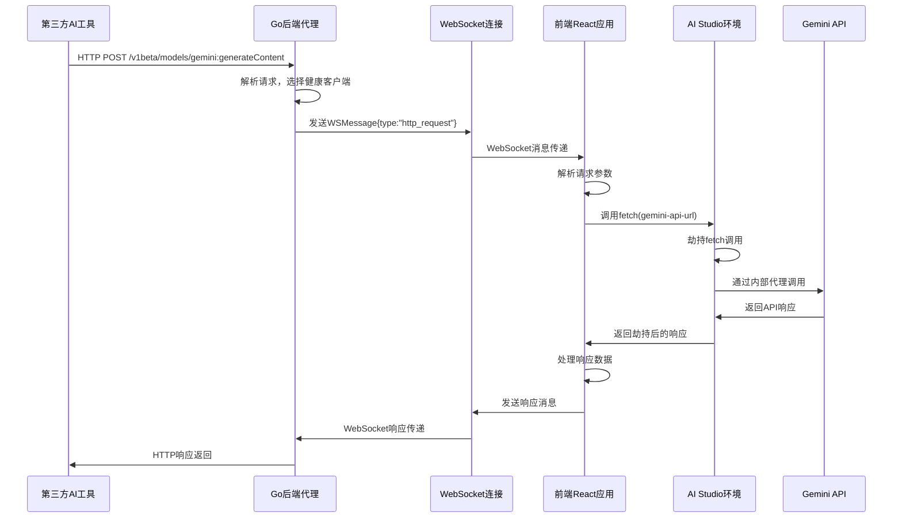

### 4.2 负载均衡场景

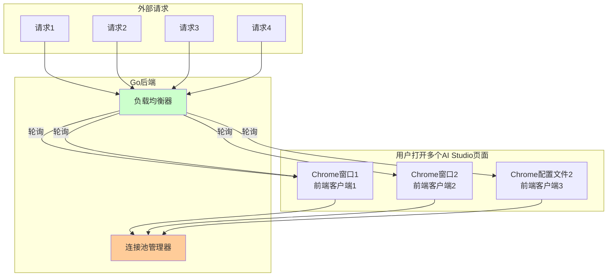

### 4.3 错误处理与重试机制

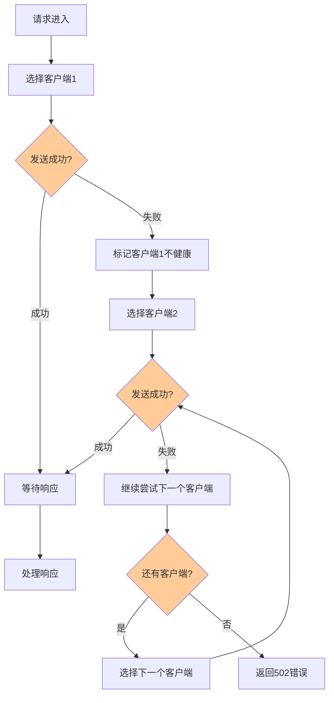

---

## 五、技术要点总结

### 5.1 核心技术栈

| 组件 | 技术栈 | 关键特性 |
|------|--------|----------|
| 后端代理 | Go + Gorilla WebSocket + Prometheus | 高并发、健康检查、负载均衡 |
| 前端应用 | React + TypeScript + Vite | 现代化构建、类型安全 |
| 通信协议 | WebSocket + HTTP | 双向实时通信 |
| 部署环境 | AI Studio Build 页面 | 特殊的iframe环境 |

### 5.2 关键设计模式

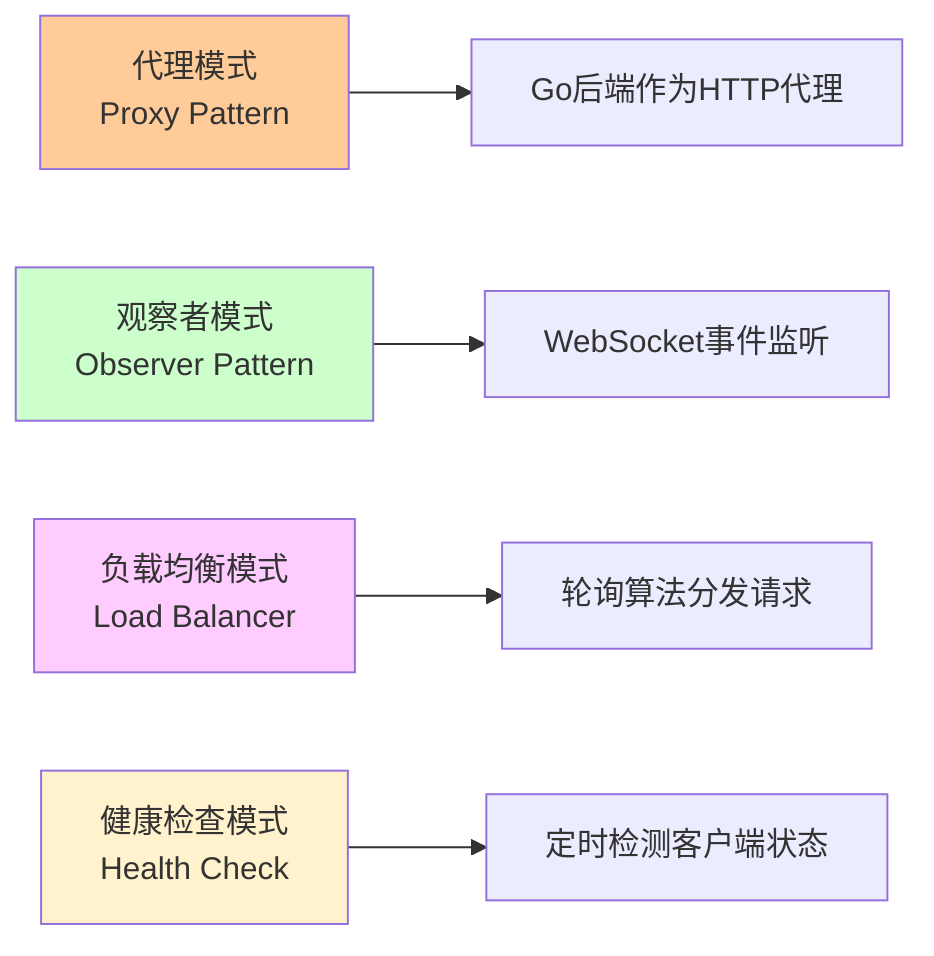

### 5.3 核心优势

1. **免费使用**: 绕过API Key限制，实现免费调用
2. **负载均衡**: 支持多客户端连接，自动分发请求
3. **高可用性**: 健康检查机制确保服务稳定
4. **易于部署**: Go二进制文件 + Web页面，部署简单
5. **透明代理**: 对第三方应用完全透明

### 5.4 潜在限制

1. **依赖AI Studio**: 必须在Google AI Studio环境中运行前端
2. **网络要求**: 需要稳定的WebSocket连接
3. **浏览器限制**: 前端必须保持浏览器窗口打开
4. **并发限制**: 受AI Studio页面并发限制影响

### 5.5 安全考虑

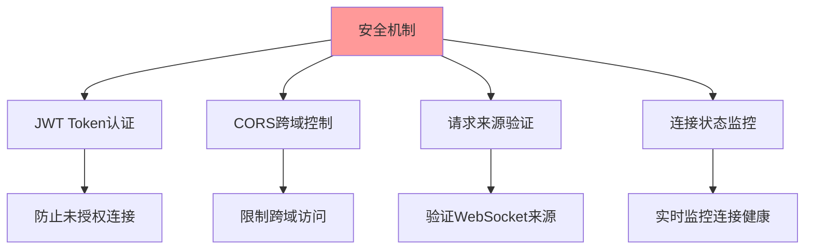

---

## 结论

这个项目展现了一个精巧的"中间人"架构设计：

- **分离关注点**: 将复杂的HTTP服务逻辑放在功能完备的Go后端，将执行逻辑简化为纯粹的指令执行者
- **利用环境特性**: 巧妙利用AI Studio的fetch劫持机制，实现免API Key调用
- **高可用设计**: 通过连接池、负载均衡和健康检查，确保服务的稳定性和扩展性

这种设计不仅技术上具有创新性，也为类似的API代理场景提供了有价值的参考架构。