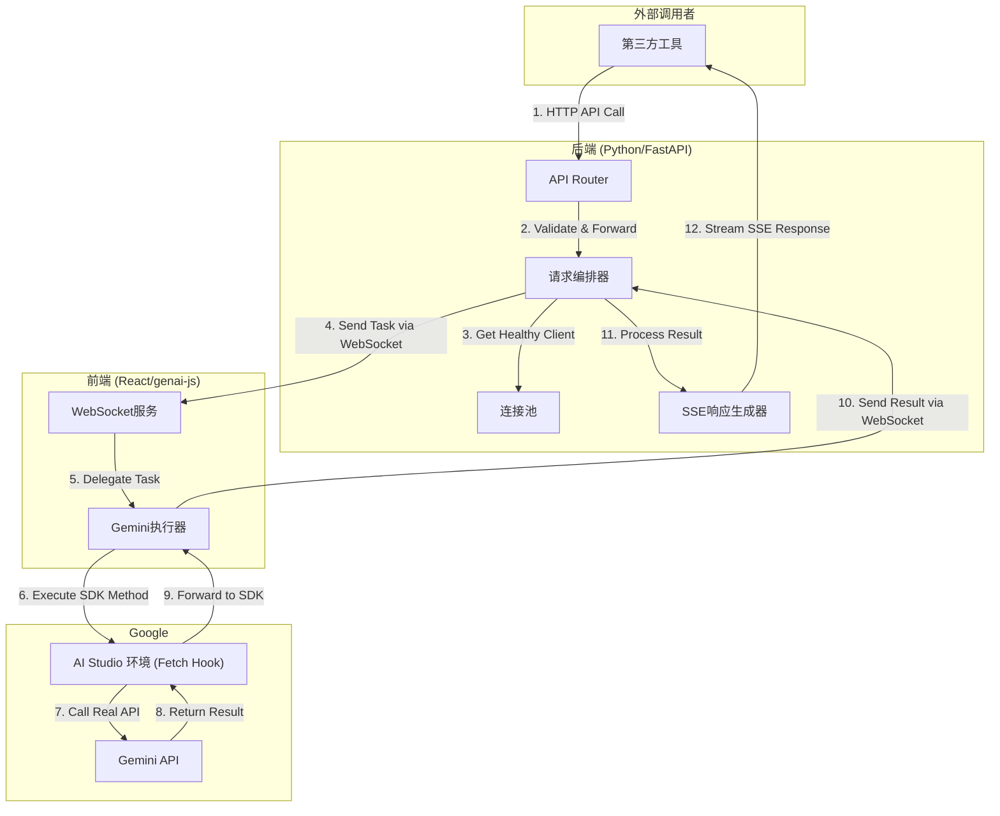

# Gemini API 代理重构计划 (Python/FastAPI)

本文档定义了将现有Go语言代理项目重构为基于Python/FastAPI和React的、功能完备、高可用的新架构的完整计划。

## 1. 核心目标

构建一个对第三方AI工具**完全透明**的、**功能完备**的Gemini API代理。该代理利用Google AI Studio环境的`fetch`劫持机制，实现免API Key调用，并通过前后端分离的架构，实现高可用和高可维护性。

## 2. 最终架构

### 2.1 统一项目目录结构 (Monorepo)

```
GeminiProxy-Python/
├── backend/
│   ├── app/
│   │   ├── api/
│   │   │   └── v1beta/
│   │   │       ├── models.py
│   │   │       ├── files.py
│   │   │       └── cached_contents.py
│   │   ├── schemas/
│   │   │   ├── gemini_models.py
│   │   │   └── websocket_models.py
│   │   ├── services/
│   │   │   ├── connection_manager.py
│   │   │   └── request_orchestrator.py
│   │   └── main.py
│   └── requirements.txt
├── frontend/
│   ├── src/
│   │   ├── components/
│   │   ├── services/
│   │   └── types/
│   ├── package.json
│   └── vite.config.ts
├── docs/
│   └── PROXY_PRINCIPLE_ANALYSIS.md
└── README.md
```

### 2.2 核心流程图



## 3. API 端点实现清单

### P0: 核心生成功能
1.  `POST /v1beta/models/{model}:generateContent`
2.  `POST /v1beta/models/{model}:streamGenerateContent`
3.  `GET /v1beta/models`

### P1: 兼容性与文件处理功能
4.  `POST /v1beta/models/{model}:countTokens`
5.  `GET /v1beta/models/{model}`
6.  `POST /v1beta/models/{model}:embedContent`
7.  `POST /upload/v1beta/files`
8.  `GET /v1beta/files`
9.  `GET /v1beta/files/{name}`
10. `DELETE /v1beta/files/{name}`

### P2: 高级缓存优化功能
11. `POST /v1beta/cachedContents`
12. `GET /v1beta/cachedContents`
13. `GET /v1beta/cachedContents/{name}`
14. `PATCH /v1beta/cachedContents/{name}`
15. `DELETE /v1beta/cachedContents/{name}`

## 4. 详细开发计划 (TODO List)

- [ ] **阶段一：项目骨架与核心通信搭建**
  - [ ] 1.1: 创建Monorepo项目目录结构
  - [ ] 1.2: 初始化后端Python环境 (`requirements.txt`)
  - [ ] 1.3: 初始化前端React环境 (`package.json`)
  - [ ] 1.4: [后端] 实现基础WebSocket连接管理器
  - [ ] 1.5: [后端] 搭建基础FastAPI应用并集成WebSocket端点
  - [ ] 1.6: [前端] 实现基础WebSocket服务，能连接到后端
  - [ ] 1.7: [前端] 创建基础UI显示连接状态和日志

- [ ] **阶段二：实现核心内容生成流程 (P0)**
  - [ ] 2.1: [后端] 定义`generateContent`和`streamGenerateContent`的Pydantic模型 (支持`tools`)
  - [ ] 2.2: [后端] 实现`:generateContent`和`:streamGenerateContent`的API端点逻辑
  - [ ] 2.3: [后端] 实现请求编排器，能处理一次性和流式请求
  - [ ] 2.4: [前端] 实现`geminiExecutor`来处理`generateContent`和`streamGenerateContent`指令
  - [ ] 2.5: 端到端测试文本生成和流式生成

- [ ] **阶段三：实现文件上传与处理流程 (P1)**
  - [ ] 3.1: [后端] 定义File API相关的Pydantic模型
  - [ ] 3.2: [后端] 实现`/upload/v1beta/files`端点，能接收文件
  - [ ] 3.3: [后端] 实现`files`的GET/DELETE端点及状态缓存逻辑
  - [ ] 3.4: [前端] 实现`geminiExecutor`来处理`uploadFile`和`getFile`指令
  - [ ] 3.5: 端到端测试文件上传、状态轮询及在prompt中使用文件

- [ ] **阶段四：实现兼容性与高级API (P1 & P2)**
  - [ ] 4.1: [后端] 实现`countTokens`和`embedContent`端点
  - [ ] 4.2: [前端] 为`geminiExecutor`添加`countTokens`和`embedContent`的处理逻辑
  - [ ] 4.3: [后端] 实现`cachedContents`的所有CRUD端点及缓存逻辑
  - [ ] 4.4: [前端] 为`geminiExecutor`添加`cachedContents`的处理逻辑
  - [ ] 4.5: 端到端测试上述所有端点

- [ ] **阶段五：实现高可用机制**
  - [ ] 5.1: [后端] 实现基于轮询的负载均衡器
  - [ ] 5.2: [后端] 实现基于Ping/Pong的健康检查机制
  - [ ] 5.3: [后端] 负载均衡器集成健康检查，只向健康的前端分发任务
  - [ ] 5.4: 在前端UI上模拟多个客户端连接，测试负载均衡效果

- [ ] **阶段六：最终集成、文档与收尾**
  - [ ] 6.1: 全面审查代码，统一日志和错误处理
  - [ ] 6.2: 编写`README.md`，提供详细的本地环境设置和启动指南
  - [ ] 6.3: 准备最终的项目交付