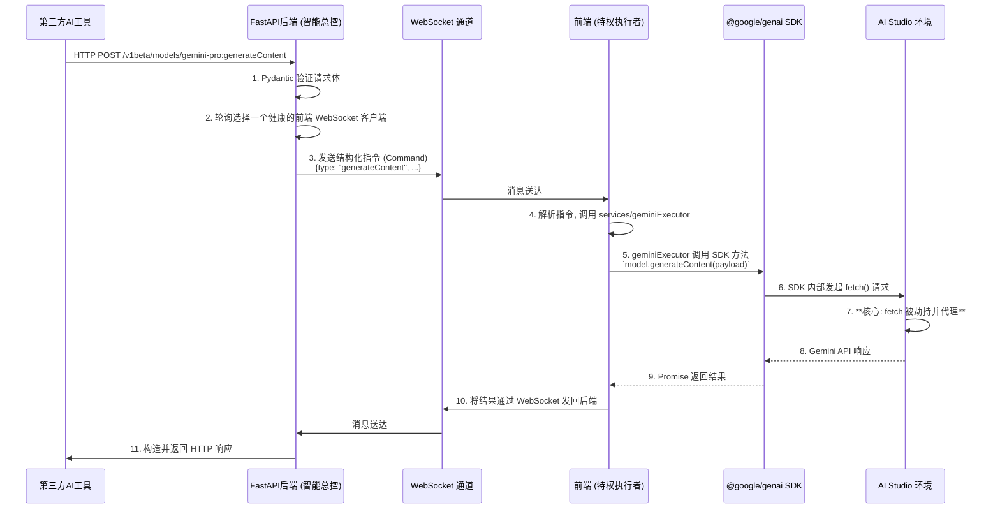

好的，这是一份专门为你的重构项目量身打造的、详细的后续开发指南。这份 Markdown 文档可以作为项目的核心 `README.md` 或 `DEVELOPMENT.md`，指导任何后续的开发者（包括未来的你）快速上手。

---

# GeminiProxy-Python - 开发指南

本文档为 `GeminiProxy-Python` 项目提供全面的技术架构解析、开发环境搭建、工作流程以及后续功能扩展的详细指南。

## 1. 核心架构与设计哲学

本项目的核心目标是**免费、稳定、高效地代理 Gemini API 请求**。

### 1.1 基本原理

我们利用了 Google AI Studio Build 页面中一个特殊的内部机制：在该环境中，所有对 `generativelanguage.googleapis.com` 的 `fetch` 网络请求都会被 Google 的脚本自动**劫持 (Hook)**，并由其内部代理附加有效的身份验证信息后转发给 Gemini API。

### 1.2 重构后的架构

我们采用**前后端分离的 Monorepo 架构**，将复杂的业务逻辑与特定的执行环境解耦，以实现高内聚、低耦合的设计。

*   **后端 (FastAPI)**: 扮演 **“智能总控 (Smart Controller)”** 的角色。它对外提供与官方完全一致的 API 接口，负责解析、验证请求，并通过 WebSocket 向前端下发结构化的、精确的执行指令。
*   **前端 (React in AI Studio)**: 扮演 **“特权执行者 (Privileged Executor)”** 的角色。它运行在 AI Studio 的“沙箱”环境中，不处理业务逻辑，只负责接收后端的指令，并使用 `@google/genai` SDK 在特权环境中执行这些指令。



## 2. 开发环境搭建

### 2.1 必备工具

请确保你的开发环境中已安装以下软件：
*   [Git](https://git-scm.com/)
*   [Conda (Miniconda)](https://docs.conda.io/en/latest/miniconda.html)
*   [Node.js (LTS)](https://nodejs.org/) (自带 npm)

### 2.2 项目初始化

1.  **克隆仓库**
    ```bash
    git clone <你的仓库地址>
    cd GeminiProxy-Python
    ```

2.  **配置后端 (FastAPI)**
    ```bash
    cd backend

    # 安装 Python 依赖
    pip install -r requirements.txt

    # 创建环境变量文件 (从模板复制)
    # cp .env.example .env  (如果提供了模板)
    # 然后编辑 .env 文件，配置端口等
    ```

3.  **配置前端 (Vite + React)**
    ```bash
    cd ../frontend

    # 安装 Node.js 依赖
    npm install

    # 创建本地环境变量文件
    # cp .env.local.example .env.local (如果提供了模板)
    # 然后编辑 .env.local, 填入后端 WebSocket 地址
    # VITE_WEBSOCKET_URL=ws://localhost:8000/ws/your-client-id
    ```

## 3. 日常开发工作流

1.  **启动后端服务**
    *   打开一个新终端，激活 Conda 环境。
    *   `cd backend`
    *   `conda activate gemini-proxy-backend`
    *   `uvicorn app.main:app --host 0.0.0.0 --port 8000 --reload`
    *   服务将在 `http://localhost:8000` 运行。

2.  **启动前端服务**
    *   打开第二个终端。
    *   `cd frontend`
    *   `npm run dev`
    *   Vite 开发服务器将启动，并提供一个本地 URL (例如 `http://localhost:5173`)。

3.  **部署与测试**
    1.  打开 Chrome 浏览器，访问 Google AI Studio。
    2.  进入 "Build with apps" 页面，选择 "Web app"。
    3.  将 Vite 提供的本地 URL (`http://localhost:5173`) 填入并运行。
    4.  此时，前端页面应显示与后端 WebSocket 的连接状态。
    5.  使用 Postman、curl 或任何 HTTP 客户端，向后端 FastAPI 服务 (`http://localhost:8000/v1beta/...`) 发送 API 请求。
    6.  观察整个数据流：后端终端的日志 -> 前端页面的日志 -> Postman 收到的最终响应。

## 4. 核心代码实现细节

### 4.1 后端 (`backend/`)

*   **`app/core/websocket_manager.py`**: 连接池的核心。
    *   `ConnectionManager` 类管理一个 `Dict[str, WebSocket]` 字典，`client_id` 为键。
    *   `connect()` 和 `disconnect()` 方法负责客户端的注册与注销。
    *   `get_next_client()` 方法实现轮询负载均衡，返回一个可用的 WebSocket 连接。
    *   未来可在此处添加健康检查逻辑。

*   **`app/api/v1/gemini_routes.py`**: API 路由层。
    *   函数签名使用 Pydantic 模型进行请求体验证，例如 `async def generate_content(model_name: str, request: GeminiGenerateContentRequest)`。
    *   主要逻辑：
        1.  调用 `manager.get_next_client()` 获取一个前端执行者。
        2.  构造一个 `Command` JSON 对象，例如 `{ "id": req_id, "type": "generateContent", "payload": request.dict() }`。
        3.  `await websocket.send_json(command)` 发送指令。
        4.  循环 `await websocket.receive_json()` 等待前端返回带有相同 `id` 的结果。

*   **`app/schemas/gemini_schemas.py`**: 数据契约。
    *   严格按照 Google Gemini API 的官方文档，使用 Pydantic 定义请求体和响应体的结构。

### 4.2 前端 (`frontend/`)

*   **`src/services/websocketService.ts`**: 通信枢纽。
    *   负责建立、维护 WebSocket 连接，并处理重连逻辑。
    *   核心是一个 `onmessage` 事件监听器，它解析从后端收到的 `Command`。
    *   根据 `command.type`，它会调用 `geminiExecutor` 中的对应函数，并将 `command.payload` 作为参数传入。
    *   执行完成后，将结果（成功或错误）连同 `command.id` 一起打包发回后端。

*   **`src/services/geminiExecutor.ts`**: SDK 执行器。
    *   引入 `@google/genai`。
    *   导出一系列 `async` 函数，如 `executeGenerateContent(payload)`。
    *   每个函数内部，初始化 `GoogleGenerativeAI` 实例，获取模型，并调用相应的 SDK 方法，如 `model.generateContent(payload)`。
    *   **注意**: 初始化 `GoogleGenerativeAI` 时传入空 API Key (`""`)，因为认证由 AI Studio 环境自动完成。

*   **`src/types/protocol.ts`**: 前后端通信协议。
    *   使用 TypeScript 的 `interface` 定义 `Command` 和 `Response` 的结构。这是保证前后端协作正确的“契约文件”。

*   **样式 (Tailwind CSS)**:
    *   所有样式通过在 `.tsx` 文件中添加原子化 CSS 类来实现。
    *   如需自定义主题（颜色、字体等），请修改 `tailwind.config.js`。
    *   避免编写传统的 `.css` 文件，拥抱 Utility-First 的理念。

## 5. 如何扩展新功能 (例如添加 `countTokens` API)

遵循以下步骤，可以清晰、安全地为项目添加新的 API 代理：

1.  **[后端] 更新 Schema**: 在 `backend/app/schemas/gemini_schemas.py` 中，为 `countTokens` 创建对应的 Pydantic 请求模型 `GeminiCountTokensRequest`。

2.  **[后端] 添加路由**: 在 `backend/app/api/v1/gemini_routes.py` 中，添加一个新的路由：
    ```python
    @router.post("/v1beta/models/{model_name}:countTokens")
    async def count_tokens(model_name: str, request: GeminiCountTokensRequest):
        # ... 几乎与 generate_content 相同的逻辑 ...
        command = {"type": "countTokens", "payload": ...}
        # ... 发送并等待响应 ...
    ```

3.  **[前端] 更新通信协议**: 在 `frontend/src/types/protocol.ts` 中，向 `Command` 类型的 `type` 字段添加 `'countTokens'` 联合类型。

4.  **[前端] 添加执行逻辑**: 在 `frontend/src/services/geminiExecutor.ts` 中，添加一个新的导出函数：
    ```typescript
    export async function executeCountTokens(payload: any) {
      const model = genAI.getGenerativeModel({ model: payload.model });
      return await model.countTokens(payload.contents);
    }
    ```

5.  **[前端] 更新指令分发器**: 在 `frontend/src/services/websocketService.ts` 的 `onmessage` 监听器中，添加一个新的 `case` 来处理新指令：
    ```typescript
    // ...
    switch (command.type) {
      // ...
      case 'countTokens':
        result = await geminiExecutor.executeCountTokens(command.payload);
        break;
    }
    // ...
    ```

通过这套标准流程，可以保证项目的功能扩展既高效又不容易出错。

---